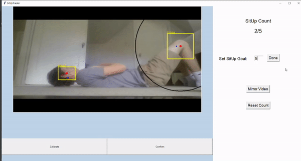
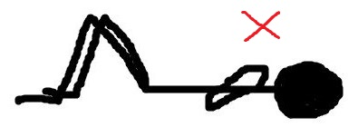
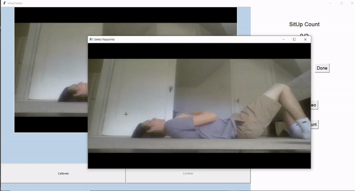

# SitUpTracker
**Python application that tracks how many sit-ups a person has done**

## Using the Application
### Required Modules
- [Python (I used version 3.6.8)](https://www.python.org/downloads/release/python-368/)
- [opencv-python](https://pypi.org/project/opencv-python/)
- [numpy](https://pypi.org/project/numpy/)
- [Pillow](https://pypi.org/project/Pillow/)
- [playsound](https://pypi.org/project/playsound/)
- [SpeechRecognition](https://pypi.org/project/SpeechRecognition/)
- Internet connection (needed for the speech recognition)

### Required Hardware
- Microphone
- Webcam
### Getting Started
Clone this repository. Using the command prompt, navigate to the repository's directory. Once inside the directory type **python main.py** to run the application.

When the application is ran, you should see your webcam's live feed appear on the screen. If not, check here. On the right hand side of the screen type in how many sit-ups that you plan to do. When finished typing, click the "Done" button. 

Set your webcam view so that you can lay down and do a complete situp with your head and knees in the frame. Make sure that your knees are on the right side of the screen. You can mirror the video by pressing the "Mirror Video" button.

 

Lay down as if you are at the beginning of a sit-up and say "Calibrate". The application should recognize this voice command and create a popup window of the current video frame. Use your cursor to click and create a box around your head. When finished, press the enter key. The application uses this head box to create a pixel to inches scale factor so that the program can estimate the real world measurements of your movements. Next, use your cursor to click and create a box somewhere on or surrounding your head. When finished, press the enter key. Next, use your cursor to click and create a box around your knee. When finished, press the enter key. You should have created three boxes. Here is a GIF to demonstrate.

Now press the Escape key.

Get back into sit-up position and line your head and knee up with the yellow boxes. When you are ready for the application to start tracking your movement, say "Confirm". You should here a sound from the application notifying you that tracking has begun.

### Tracking Errors
Occasionally, the application may lose track of your head or knee location. If you notice this or the right side of the screen turns red (signifying that the tracker has failed), recalibrate the application (i.e. redraw the boxes around your whole head, specific head region, and knee region).

The tracker does best when the object it is tracking is a different color from its surrounding objects, so try not to have a background with colors that could confuse the tracker. Also, don't make any jerky movements as this will likely confuse the tracker, especially with the low frame rate of most webcams.

### Reaching Your Sit-up Goal
Once you have reached your sit-up goal, the application will make a chime sound to notify you. You can reset your current sit-up count using the "Reset Count" button. 

### Understanding The Video Graphics
The yellow boxes represent the tracked area calculated by the tracker. The red dots are the centroid of each yellow box. The blue dots are the starting points for the tracked objects. The black ring around the knee box represents the area for which your head must enter in order for the application to register that you have reached the top of a sit-up. 

## Motivation
Whenever I workout, I like to listen to music or watch TV. Sometimes I lose track of how many reps of an exersise I have done. This is what inspired the idea of this application. Certainly, the application wouldn't be that practical, but it would be a fun learning experience. 

## The Development Process
I knew that I wanted the application to be able to track sit-ups from just a video feed rather than having physical tracking devices attached to the person.

I found out that there was a Python library called [OpenPose](https://github.com/CMU-Perceptual-Computing-Lab/openpose) that could detect keypoints on full body images of people. This meant it could track different joints which would be great for determining if a sit-up had been done. Unfortunately, there were two big issues with using OpenPose for my application. The first issue was that the tracking was not accurate from a side view of a person. The library would mix up my left and right limbs due to the frequent occlusion of one of them. The second issue was that the library made the frame rate of the live webcam feed very bad (around 9 frames per second). These two issues were what led me to scrap the OpenPose idea and look for a new approach.

My new approach was to use object tracking to track keypoints on the person such as their head, knees, and feet. Opencv, a Python library that I was already using to display the webcam feed, had multiple built-in object tracking algorithms. I learned about the different algorithms and how to set up an object tracker [here.](https://www.pyimagesearch.com/2018/07/30/opencv-object-tracking/) After a few lines of code, I was able to track anything in the live webcam feed! 

The object tracking setup had one minor problem. To track an object, you must grab the current frame of the video and use your mouse to highlight the region of interest (ROI) that contains the object to track. Once the ROIs were selected, the algorithms would immediately start trying to track the boxed objects. The issue with this is that when doing a sit-up, in order to get the person's head and knees in the video throughout the whole sit-up process, the webcam and computer have to be a few feet away from the person. It is impossible to reach over to the computer and stay in the same sit-up position.

I figured that I could use hand gestures to tell the application to take a screenshot so that the person could go over to the computer and mark the ROIs on an image of the person in sit-up position. Then the person could get back into sit-up position and gesture for the application to end the ROI selection proccess and start tracking. I tried using a [Haar Cascade](http://www.willberger.org/cascade-haar-explained/) hand classifier to identify hands in webcam feed, but the accuracy was very poor. 

Instead of using hand gestures for controlling the application away from the computer, I ended up using speech recognition to implement voice commands. Unfortunately, this meant that the application would require an internet connection to work since Google's speech recognition API is used, but I wasn't willing to look for anymore solutions as I had spent way too long on this part of the application and was getting frustrated. 

