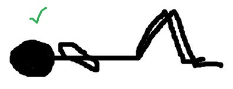

# SitUpTracker
**Python application that tracks how many sit-ups a person has done**

## Setup
### Required Modules
- [Python (I used version 3.6.8)](https://www.python.org/downloads/release/python-368/)
- [opencv-python](https://pypi.org/project/opencv-python/)
- [numpy](https://pypi.org/project/numpy/)
- [Pillow](https://pypi.org/project/Pillow/)
- [playsound](https://pypi.org/project/playsound/)
- [SpeechRecognition](https://pypi.org/project/SpeechRecognition/)

### Required Hardware
- Microphone
- Webcam
## Getting Started
### Running The Application
Clone this repository. Using the command prompt, navigate to the repository's directory. Once inside the directory type **python main.py** to run the application.
### Using The Application
When the application is ran, you should see your webcam's live feed appear on the screen. If not, check here. On the right hand side of the screen type in how many sit-ups that you plan to do. When finished typing, click the "Done" button. 

Set your webcam view so that you can lay down and do a complete situp with your head and knees in the frame. Make sure that your knees are on the right side of the screen. You can mirror the video by pressing the "Mirror Video" button.

 

Lay down as if you are at the beginning of a sit-up and say "Calibrate". The application should recognize this voice command and create a popup window of the current video frame. Use your cursor to click and create a box around your head. When finished, press the enter key. The application uses this head box to create a pixel to inches scale factor so that the program can estimate the real world measurements of your movements. Next, use your cursor to click and create a box somewhere on or surrounding your head. When finished, press the enter key. Next, use your cursor to click and create a box around your knee. When finished, press the enter key. You should have created three boxes. Here is a GIF to demonstrate.

Now press the Escape key.
